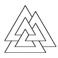
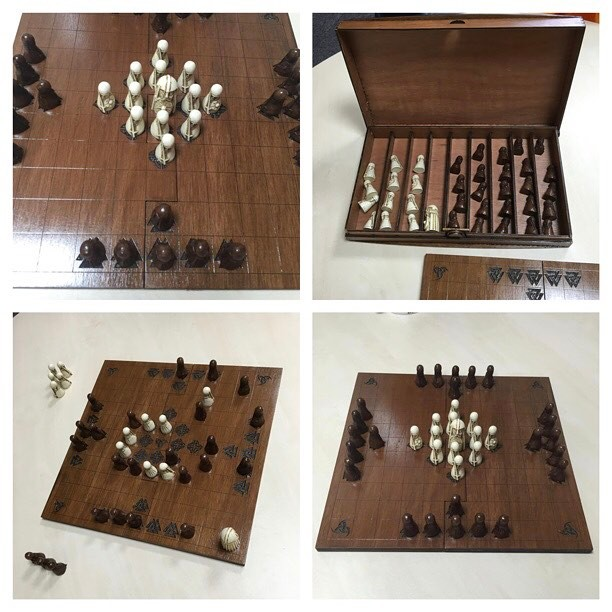

# Tafl

Talf

- [Site](http://alexhedley.github.io/talf/)

Tafl, The Viking Game,

## Buy

- [National Museums Scotland](http://shop.nms.ac.uk/collections/toys-games-games-chess/products/the-viking-game-hnefatafl)

> ### Description

> Hnefatafl ˈne-fə-taː-f(ə)l is a simple but addictive game of strategy. Roughly translated as “The Kings Table”, the game recalls a time of feuding Viking lords and violent invasions. Popular since 400AD, Hnefatafl has stood the test of time as a great game for all the family. Channel your inner Viking chief and put your warmongering skills to the test with this Nordic inspired set, exclusive National Museums Scotland.

> This premium quality Hnefatafl set contains 37 playing pieces consisting of 1 king, 12 defenders and 24 attackers in two different coloured designs, a natural linen playing board, and playing rules in English, French, German and Japanese.

> Dimensions:

> Board: 29 x 29 cm

> Playing pieces: approx 3cm

## Info

A wooden board was designed in collaboration and made by [Basically Wooden](http://www.basicallywooden.co.uk/)

I decided on 3 symbols from [Symbol Dictionary](http://symboldictionary.net/?page_id=703)

- [Shield Knot](http://symboldictionary.net/?p=146) for Defenders
- [Odins Horn](http://symboldictionary.net/?p=714) for the King's piece
- [Valknut](http://symboldictionary.net/?p=741) for Attackers

## Books

I've bought these books which are excellent.

- [Reconstructing Hnefatafl](https://www.amazon.co.uk/Reconstructing-Hnefatafl-Damian-Walker/dp/1291730788/)
- [An Introduction to Hnefatafl](https://www.amazon.co.uk/Introduction-Hnefatafl-Damian-Gareth-Walker/dp/1326372335/)

## Links

- [Wikipedia](https://en.wikipedia.org/wiki/Tafl_games)
- [http://tafl.cyningstan.com](http://tafl.cyningstan.com/)
- [https://boardgamegeek.com/boardgame/2932/hnefatafl](https://boardgamegeek.com/boardgame/2932/hnefatafl)
